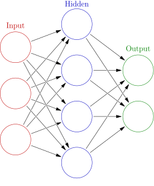

# Basics of Neural Networks
An artificial neural network is a fundamental computing technique and structure 
in artificial intelligence and machine learning. Large Language Models (LLMs)
are a very successful type of neural network but neural networks as a general
tool are used in other domains and to solve different problems like machine 
vision, natural language processing, self-driving automobiles, and other uses.[^NN_BEG]

## Structure of a Neural Network
[^WIKIPEDIA]

The basic unit of a neural network is a neuron that takes numerical inputs, performs 
mathematical operations on those inputs, and produces a numerical output. 

Multiple neurons are combined and structured into layers: 
- **Input layer** (red circles in the graphic above)
- **One or More hidden layers** (blue circles)
- **Output layer** (green circles). 

Before training a neural network, a **loss** function is needed as a way to quantify 
how "good" the network is doing in order for the network to learn and improve. The 
Mean Squared Error is a common **loss** function for regression problems and simple
networks. When training a network, we are trying to minimize the **loss** function thereby
improving the predictive power of the network.[^HOU]

Neural Nets can be trained either with **supervised learning** where the neural network 
has access to both the inputs and expected outputs and is able to generate a **loss** function
based on this training data.

For **unsupervised learning**, the neural network does not have the expected outputs and therefore
is used to create patterns and relationships in the input data without have a reference to outputs
for calculating a **loss** function.

[^NN_BEG]: [What is a neural network?](https://www.geeksforgeeks.org/neural-networks-a-beginners-guide/)
[^WIKIPEDIA]: [Neural Network (machine learning)](https://en.wikipedia.org/wiki/Neural_network_(machine_learning))
[^HOU]: [Machine Learning for Beginners: An Introduction to Neural Networks](https://victorzhou.com/blog/intro-to-neural-networks/)
